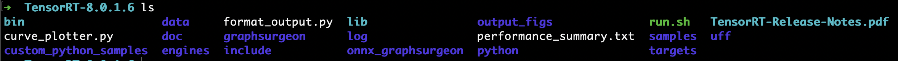

# Oh_My_TensorRT_ToolKit

[](https://github.com/RichardLitt/standard-readme)

## Table of Contents

- [Background](#background)
- [Installation](#installation)
- [Usage](#usage)
- [Examples](#examples)
- [Related Efforts](#related-efforts)
- [Maintainers](#maintainers)
- [Contributing](#contributing)
- [License](#license)

--------

## Background

###### Introduction

*Oh_My_TensorRT_ToolKit* is **a wrapped toolkit for GPU performance test using various NN models based on [TensorRT official source code](https://github.com/NVIDIA/TensorRT).** 

> I develop this toolkit only for providing the assistance of GPU performance test when we use the official TensorRT tools. Besides, this toolkit could be highly customed in different versions of TensorRT, please refer to the [Contributing](#contributing) part.

 *Oh_My_TensorRT_ToolKit* needs serveral procedures to established, which could be found in [Usage](#usage) part. We implement this toolkit by basicly using the [./trtexec](https://github.com/NVIDIA/TensorRT/tree/master/samples/opensource/trtexec), a TensorRT Command-Line Wrapper provided by NVIDIA TensorRT official samples, in our scripts.

The **workload** of *Oh_My_TensorRT_ToolKit* is:

1. **Generate Onnx models from our Pytorch / Tensorflow models**. We provide both *Pytorch* and *Tensorflow* examples in [Examples](#examples) part.
2. **Generate dynamic engines from the Onnx models by using ./trtexec tool**.
3. **Perform inference tests with the engines in different MIG devices and batch sizes**.
4. **Format output the throughput / latency statistical results**.

As for the generation of onnx model, we provide both *Pytorch* and *Tensorflow* examples in [Examples](#examples) part.

###### GPU Environment

 *Oh_My_TensorRT_ToolKit* should be used on GPU environment, and our standard GPU device and drivers are:

- **GPU Device**: **A100-PCIE-40GB with MIG mechanism** (temporarily 3 MIG devices)

```shell
GPU 0: A100-PCIE-40GB (UUID: GPU-9de3d0e8-33f5-10dc-0c79-2c88a7ab0a23)
  MIG 4g.20gb Device 0: (UUID: MIG-GPU-9de3d0e8-33f5-10dc-0c79-2c88a7ab0a23/2/0)
  MIG 2g.10gb Device 1: (UUID: MIG-GPU-9de3d0e8-33f5-10dc-0c79-2c88a7ab0a23/3/0)
  MIG 1g.5gb Device 2: (UUID: MIG-GPU-9de3d0e8-33f5-10dc-0c79-2c88a7ab0a23/9/0)
```

​	More introductions on MIG mechanism could be found in [Basic on MIG Tutorial](https://github.com/DicardoX/Oh_My_TensorRT_ToolKit/blob/main/docs/Basic_on_MIG.md).

- **Drivers**:
    1. NVIDIA-SMI 460.80, Driver Version: 460.80
    2. **CUDA Version**: 11.2
    3. **Pycuda Version**: 2021.1
    4. **TensorRT Version**: 8.0.1.6
    5. **Torch Version**: 1.9.0+cu111 (Customed configurations could be found in [Pytorch Official](https://pytorch.org/get-started/locally/))
    6. **Torchvision Version**: 0.10.0+cu111
    7. **Pytorch-pretrained-bert Version**: 0.6.2 (This is for the usage of bert model)
    8. **Onnx Version**: 1.9.0
    9. **Netron Version**: 5.0.0
    10. **Onnxruntime Version**: 1.2.0
    11. **Tensorflow Version**: 2.5.0
    12. **H5py Version**: 3.1.0

------------

## Installation

###### Step 1. TensorRT Installation

Before we start, you should be informed that **the codes we provide in our repository are the supplement to the official TensorRT source code**. Therefore, we should first download and install TensorRT referred to the [Tutorial](https://blog.csdn.net/zong596568821xp/article/details/86077553).

1. Install pycuda: `pip install pycuda==2021.1`

2. **Download TensorRT official source code** in [Download link](https://developer.nvidia.com/nvidia-tensorrt-download), you should choose the correct version based on your system and CUDA Version. (In our experiment, we use *TensorRT 8.0.1 GA for Linux x86_64 and CUDA 11.3 TAR package*)

3. **Install**. 

    ```shell
    # Unzip
    tar xvf TensorRT-8.0.1.6.Linux.x86_64-gnu.cuda-11.3.cudnn8.2.tar
    # Install TensorRT
    cd TensorRT-8.0.1.6/python
    pip install tensorrt-8.0.1.6-cp38-none-linux_x86_64.whl	# Correspond to you python version, cp38 means python3.8
    # Install UFF
    cd TensorRT-8.0.1.6/uff
    pip install uff-0.6.9-py2.py3-none-any.whl
    # Install graphsurgeon
    cd TensorRT-8.0.1.6/graphsurgeon
    pip install graphsurgeon-0.4.5-py2.py3-none-any.whl
    ```

4. **Add environment path**. 

    ```shell
    touch .tensorrt_bashrc
    nano .tensorrt_bashrc
    # Write into it
    export LD_LIBRARY_PATH=$LD_LIBRARY_PATH:/home/cyxue/TensorRT-8.0.1.6/lib
    # Every time we establish a session, source it
    source .tensorrt_bashrc
    ```

###### Step 2. Oh_My_TensorRT_ToolKit Installation

After we finish the installation of official TensorRT, we begin to install *Oh_My_TensorRT_ToolKit* based on it.

1. **Git our repository to get the codes**:

    ```shell
    git clone https://github.com/DicardoX/Oh_My_TensorRT_ToolKit.git
    ```

2. **Add the contents in our repository into the main directory of TensorRT official source code**. As for `./data`, which is already contained in it, we just merge them.

3. The main directory of *Oh_My_TensorRT_ToolKit* should look like this (except for README.md and its related files):



-----------

## Usage

This is only a documentation package. You can print out [spec.md](spec.md) to your console:


### Generator

To use the generator, look at [generator-standard-readme](https://github.com/RichardLitt/generator-standard-readme). There is a global executable to run the generator in that package, aliased as `standard-readme`.

## Examples

To see how the specification has been applied, see the [example-readmes](example-readmes/).

## Related Efforts

- [Art of Readme](https://github.com/noffle/art-of-readme) - 💌 Learn the art of writing quality READMEs.
- [open-source-template](https://github.com/davidbgk/open-source-template/) - A README template to encourage open-source contributions.

## Maintainers

[@RichardLitt](https://github.com/RichardLitt).

## Contributing

Feel free to dive in! [Open an issue](https://github.com/RichardLitt/standard-readme/issues/new) or submit PRs.

Standard Readme follows the [Contributor Covenant](http://contributor-covenant.org/version/1/3/0/) Code of Conduct.

### Contributors

This project exists thanks to all the people who contribute. 
<a href="https://github.com/RichardLitt/standard-readme/graphs/contributors"></a>


## License

[MIT](LICENSE) © Richard Littauer

A wrapped toolkit for GPU performance test using various NN models based on TensorRT official source code.
